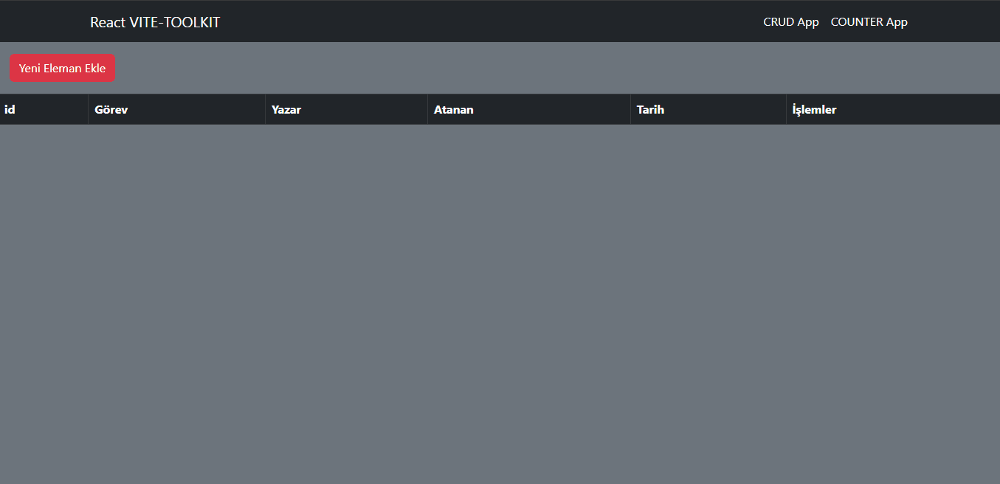

# VITE-TOOLKİT-CRUD APP

## Used Libraries

- redux
- react-redux
- reduxjs/toolkit
- react-router-dom
- react-bootstrap

## Two Apps : Counter App - Crud App 

### Counter app : buttons are increase, decrease, reset

### Crud App : add new todo , delete button for remove todo, edit button for todo . To do these tasks , you may open modal  page . This page contains ; title , author, assigned_to , end_date. 

